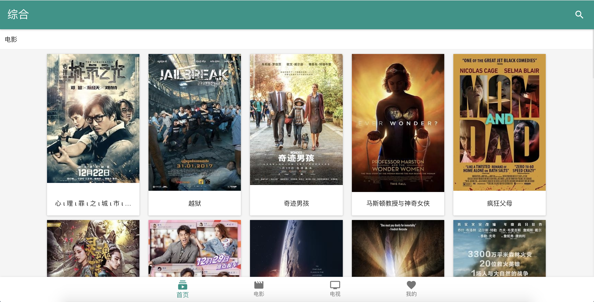

## 基于vue2.0构建的在线电影网
技术栈： webpack + vue + vuex + veu-router + muse-ui + es6

api来源于网上，仅供开发参考之用，禁用于商业，否则后果自负

## 屏幕截图，该项目使用了响应式布局

### 动画演示
<figure class="half">

</figure>

### 移动端效果
<figure class="half">

</figure>
<figure class="half">

</figure>

### pc端效果


### 主要特色：

1. 组件化开发
2. 下拉刷新
3. 无限加载
4. 浏览历史
5. 响应式布局
6. 缓存数据
8. 收藏
9. 视频播放
10. md风格模式
11. 主题更换

### 运行 

```
npm install

npm run dev

npm run build

```

### 目录结构
```
# web目录结构

├─build                 # build配置目录
├─config                # 相关配置
├─img                   # 屏幕截图
├─src                   # 项目源码主目录	
│  ├─assets             # 资源
│  │  └─less            # less通用文件目录
│  ├─components         # 页面及其组件
│  ├─router             # 路由
│  └─vuex               # vuex，其中包含了全局api，状态管理器
│      └─modules        # moduless
│  └─api                # 统一api请求
│      └─index          # index
│  └─base               # 公用的一些函数及配置
│      └─config         # 配置文件
│      └─fetch          # 封装好的统一请求
│  └─filters            # 过滤器
│      └─index          # index
├─static                # 外部资源引入
│  ├─css                # 外部样式
│  │  ├─font            # 字体图标
│  │  └─woff            # 字体图标
│  └─js                 # 外部js	
└─test                  # 测试用，不用管这个
    ├─e2e
    │  ├─custom-assertions
    │  └─specs
    └─unit
        └─specs
```

